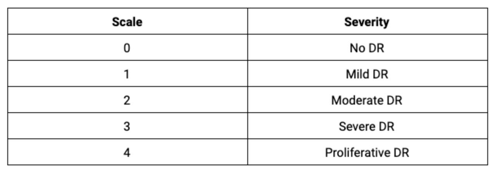
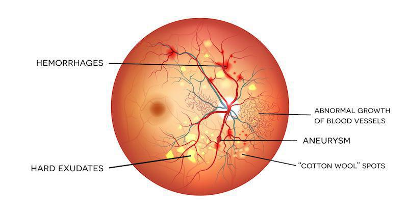
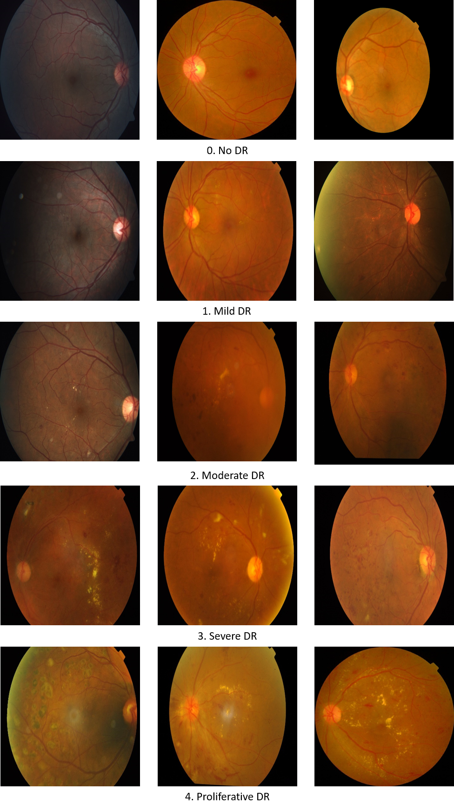
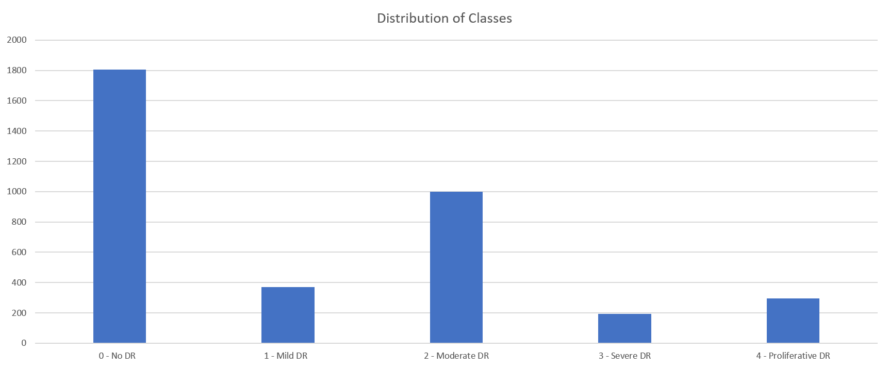
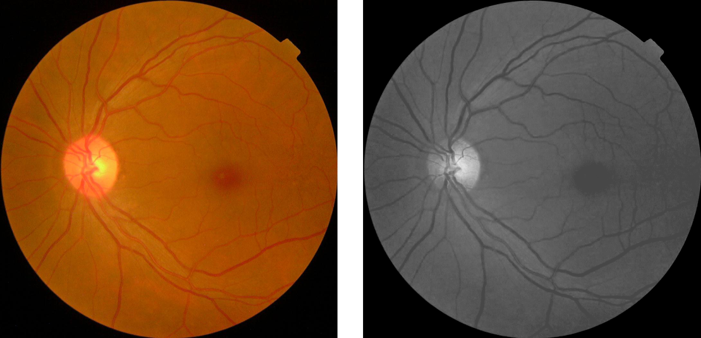

<h1>
Detection of Diabetic Retinopathy
</h1>

<h2>
Project Proposal | DS5500 | Fall 2019
</h2>

<h4>
Anish Narkar, Nikhar Gaurav, Prasanna Challa, Prathwish Shetty
</h4>

### Summary:

Millions of people suffer from diabetic retinopathy (DR), the leading cause of blindness among working-age adults. Early detection of disease can prevent blindness among people living in rural areas where medical screening is difficult to conduct. Currently, technicians travel to these rural areas to capture images and then rely on highly trained doctors to review the images and provide diagnosis. Our goal is to develop a machine learning model capable of diagnosing DR based solely on retinal scans in order to reduce the amount of diagnostic work that is placed on medical experts

The problem we are trying to solve is a multilabel image classification task predicting the severity of diabetic retinopathy on a scale of 0 to 4.

#### Detection:

There are 5 main conditions that could help identify diabetic retinopathy:

From visual inspection, we have found that the cases of Aneurysm and Abnormal growth of blood vessels are relatively hard to identify.

### Proposed Plan:

The images in the 5 categories mentioned look indistinguishable in some cases. We are planning to perform preprocessing on the original images to highlight the areas of eye which could help us identify the disease. Techniques like auto-cropping, grayscale filtering, Gaussian filtering and data augmentation before developing models, which could potentially improve the performance. Variants of popular convolution neural networks like VGG 16, AlexNet and other architectures (or even pre-trained models) could then be compared to find the best model.

#### Dataset:

Dataset consists of a large set of retina images taken using the Fundus photography. There are 3662 images in the training set and 1928 in the test set. Considering the subjective nature of the problem, each Image is rated on a scale of 0 to 4 based on the severity of diabetic retinopathy by expert doctors. Images may contain artefacts, be out of focus, underexposed, or overexposed. The images we regathered from multiple clinics using a variety of cameras over an extended period of time, which will introduce further variation.

#### Evaluation metrics:

We are using 2 evaluation metrics to assess the performance of our models: accuracy and quadratic weighted kappa. Kappa statistic measures the agreement between two ratings. This metric typically varies from 0 (random agreement between raters) to 1 (complete agreement between raters). In the event that there is less agreement between the raters than expected by chance, the metric may go below 0. The quadratic weighted kappa is calculated between the scores which are expected/known and the predicted scores. 

### Preliminary Result:

The class distribution of target variable shows a high percentage of samples for some classes (0 and 2) and low for others (1, 3, 4) as shown in the Distribution of Classes figure below, which need to be addressed while modelling. Preprocessing of images is a major part in improving accuracy since some of the features like abnormal growth of blood vessels which were not clearly distinguished as shown below could be modified and highlighted using image processing filters like gray scale, color croppin and Gaussian filters.

### References:

[1] [APTOS 2019 Blindness Detection](https://www.kaggle.com/c/aptos2019-blindness-detection/overview/description)

[2] [APTOS 2019 Blindness Detection](https://www.kaggle.com/c/aptos2019-blindness-detection/overview/description)
